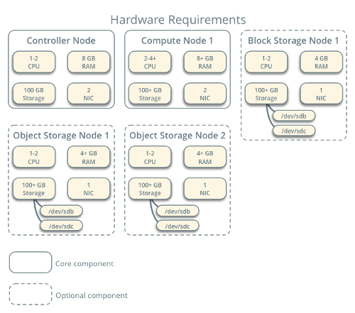

# Capítulo 3

## OpenStack: Implantação e uso

### Requisitos de hardware e software

O OpenStack é composto por uma estrutura modular. Embora seja possível realizar uma instalação mínima em uma única máquina (física ou virtual) para fins didáticos, uma instalação de produção requer várias máquinas físicas para distribuir adequadamente os diversos serviços.

A figura abaixo ilustra uma possível arquitetura de hardware: 

A figura abaixo ilustra uma possível arquitetura de software: 
