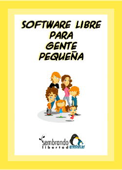
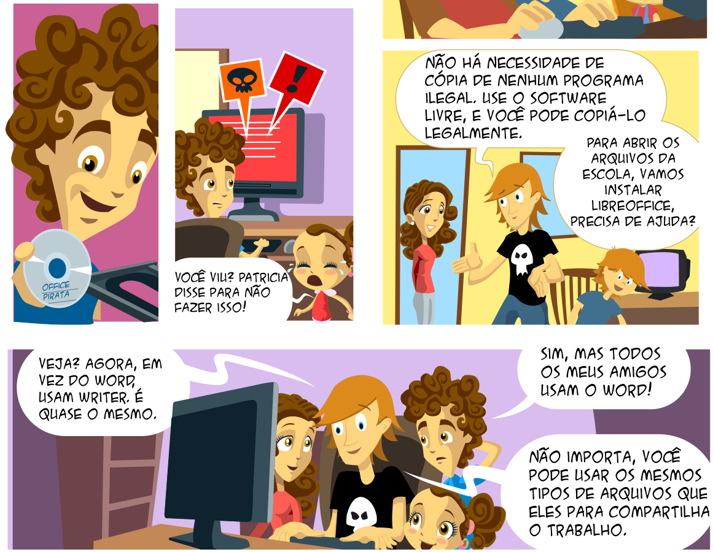
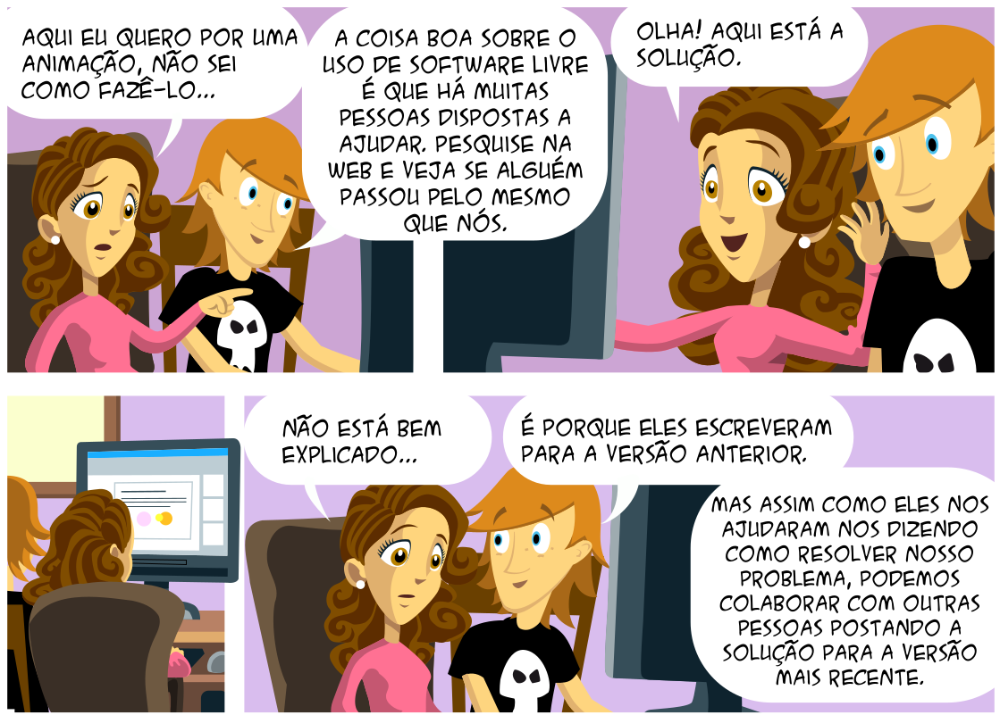

# Capítulo 5

**Semeando Liberdade**

_Como (e onde) o software livre inclui as pessoas_

Flávio Gomes da Silva Lisboa

## O que é Software Livre

Por “software livre” devemos entender aquele software que respeita a liberdade e senso de comunidade dos usuários. Grosso modo, isso significa que os usuários possuem a liberdade de executar, copiar, distribuir, estudar, mudar e melhorar o software. Assim sendo, “software livre” é uma questão de **liberdade**, não de preço. 
Um programa é software livre se os usuários possuem as quatro liberdades essenciais:

* A liberdade de **executar** o programa como você desejar, para qualquer propósito (liberdade 0).
* A liberdade de **estudar** como o programa funciona, e adaptá-lo às suas necessidades (liberdade 1). Para tanto, acesso ao código-fonte é um pré-requisito.
* A liberdade de **redistribuir** cópias de modo que você possa ajudar ao próximo (liberdade 2).
* A liberdade de **distribuir** cópias de suas versões modificadas a outros (liberdade 3). Desta forma, você pode dar a toda comunidade a chance de beneficiar de suas mudanças. Para tanto, acesso ao código-fonte é um pré-requisito.

A seguir apresentaremos uma ilustração dos fundamentos do software livre a partir da história de duas famílias que tem experiências diferentes com o uso de computadores. Essa história foi produzida pelo projeto Sembrando Libertad, do ministério de educação da Argentina.

## O que é Tecnologia Social

Segundo Dagnino (2004, p. 193), **tecnologia social** é (ou deveria ser) a denominação para uma tecnologia: 
* Adaptada a pequeno tamanho físico e financeiro;
* Não-discriminatória (patrão-empregado);
* Orientada para o mercado interno de massa;
* Liberadora do potencial e da criatividade do potencial e da criatividade do produtor direto;
* Capaz de viabilizar economicamente os empreendimentos autogestionários e as pequenas empresas.

Para saber mais:

[Programando o Futuro] (https://www.slideshare.net/programandoofuturo/tecnologia-social)

## O que é Inclusão Digital

Segundo Mori (2011, p. 40), “as compreensões de ‘inclusão digital’ podem ser aglutinadas em três vertentes: 

a)‘inclusão   digital’   como   acesso;

b)‘inclusão digital’ como  “alfabetização   digital”;   e

c)’inclusão digital’ como apropriação de tecnologias.”

As três vertentes como verbos:

* Ter
* Usar
* Apropriar-se (dominar, controlar)

### Inclusão Digital como Acesso

Segundo Mori (2011, p. 40), “tem como foco a garantia do acesso à infraestrutura de TICs. Uma característica desta abordagem é utilizar como indicador principal de ‘inclusão digital’ a disseminação de  bens e serviços relacionados à informática e às  telecomunicações.”

### Inclusão Digital como Alfabetização Digital

Segundo Mori (2011, p. 40), “a   característica  principal  desta segunda abordagem compreende a   infraestrutura tecnológica como algo similar ao lápis e ao papel para quem não é alfabetizado.”

### Inclusão Digital como Apropriação de Tecnologias

Segundo Mori (2011, p. 41), “a terceira vertente considera como efetivo objetivo da ‘inclusão digital’ a apropriação das TICs, e não apenas a capacidade de uso básico que a ‘alfabetização digital’ proporciona. Defende que exista não apenas acesso à infraestrutura e ‘alfabetização digital’, mas processos mediante os quais as pessoas sejam capazes de compreender o significado dos meios técnicos e digitais, reinventar seus usos e não se constituir como meros consumidores”.

### Exclusão Digital

Segundo Bastos, Kaneko, Napolitano e Reis (2012), "a exclusão digital é uma das muitas formas de manifestação da exclusão social". Para eles, "ser excluído digitalmente é não ter acesso à informação, conhecimento, opiniões e tecnologias." Os autores citam uma frase de Pierre Lévy: "Toda nova tecnologia cria seus excluídos".

## Uso da Tecnologia da Informação para Fins Sociais

## Inclusão Digital X Inclusão Social

**Inclusão social** é oferecer oportunidades iguais de acesso a bens e serviços a todos.

Uma das vertentes da inclusão digital é a **garantia do acesso** à infraestrutura de TICs.

Inclusão digital **pode** ser um instrumento para inclusão social.

## A Questão

Como (e onde) o software livre inclui as pessoas?

Digitalmente? 

Socialmente?

Em qualquer um dos casos, isso é **suficiente**?

## Software Livre

“Nós fazemos campanha por essas liberdades porque todo mundo merece. Com essas liberdades, os usuários (tanto individualmente quanto coletivamente) controlam o programa e o que ele faz por eles. Quando os usuários não controlam o programa, o programa controla os usuários. O desenvolvedor controla o programa e, por meio dele, controla os usuários. Esse programa não livre é “proprietário” e, portanto, um instrumento de poder injusto”. (GNU PROJECT)

## Soberania Tecnológica

“¿O es que un estado que tenga sus finanzas, salud, educación, … en manos de corporaciones tecnológicas puede decir que es independiente? ¿o que sus datos están seguros? ¿o que controla su tecnología?”. (RAMÓN)

## Referências bibliográficas

BASTOS, Caio Gomide. KANEKO, Flávia Yukimi. NAPOLITANO, Guilherme. REIS, Thiago de Barros. **Inteligência Coletiva e Inclusão Digital**. 2012. Disponível em <https://pt.slideshare.net/thiagodbr/inteligncia-coletiva-e-incluso-digital-12520004>.

DAGNINO, Renato. A tecnologia social e seus desafios. **Tecnologia social**: uma estratégia para o desenvolvimento. Fundação Banco do Brasil. Rio de Janeiro : 2004 

GNU PROJECT. **What is free software?** Disponível em <http://www.gnu.org/philosophy/free-sq.html>. Acesso em 11 out 2017.

MORI, Cristina Kiomi. **Políticas públicas para inclusão digital no Brasil**: aspectos institucionais e efetividade em iniciativas federais de disseminação de telecentros no período 2000-2010. Tese (Doutorado em Política Social) – Instituto de Ciências Humanas. Universidade de Brasília, 2011. 

RAMÓN, Ramón. **Soberania Nacional e Independencia Tecnológica**: Soberanía Tecnológica. Disponível em <https://pt.slideshare.net/ramonramonsa/soberania-tecnologica-fisl14>
