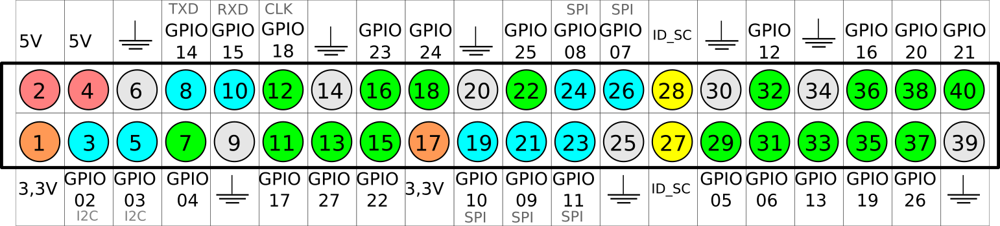
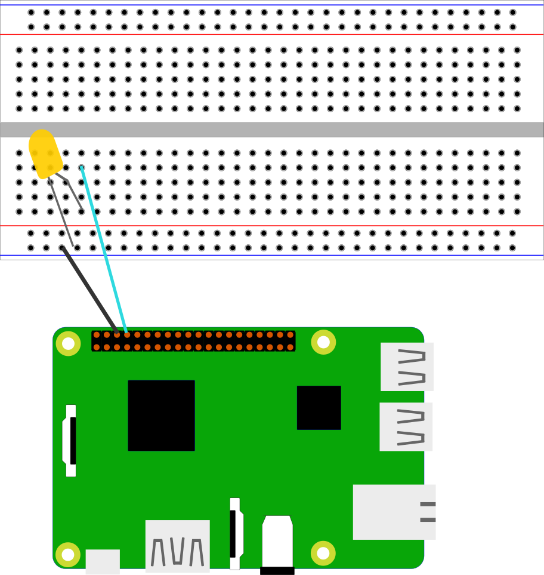
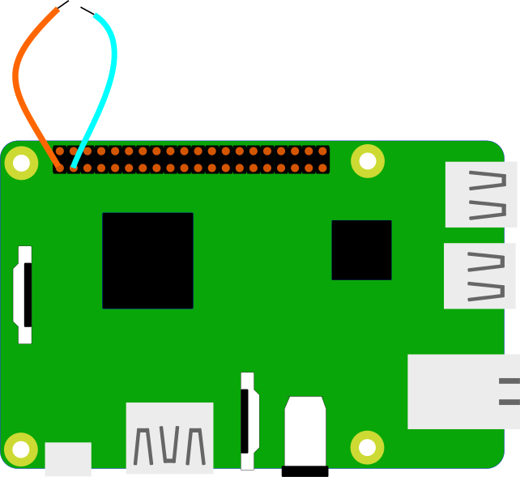

# Capítulo 6

**Programando Hardware: Utilizando Recursos GPIO do
Raspberry Pi**

Fabiano Sardenberg Kuss


## Introdução

A eletrônica digital integrada a circuitos micro-controlados ou microprocessados permitiu uma nova forma de criação de componentes e dispositivos especialistas. Com uma grande gama de componentes implementados em circuitos integrados complexos, interfaces de comunicação, sensores diversos embarcadas em placas e popularização de motores de passo e servo motores é possı́vel criar dispositivos capazes de atender a quase todas as ideias de automação sem custos elevados ou necessidade de equipamentos para apoio ao desenvolvimento dos circuitos.

A integração entre dispositivos eletrônicos e interface GPIO é uma opção de deve ser investigada com muito critério pois na maioria das vezes é possı́vel utilizar placas muito mais baratas e menos complexas, tanto do ponto de vista do software necessário para o processamento quanto do próprio hardware SBC, na implementação de automação de sistemas. Vale destacar que apenas sinais digitais podem ser processados por este tipo de interface, o que nem sempre é adequado a sensores que dependem de precisão a partir de dados analógicos.


## GPIO

A sigla GPIO significa General-purpose input/output, que pode ser traduzido como entrada e saı́da de propósito geral, representando um conjunto de pinos capazes de receberem e enviarem sinais para uma funcionalidade genérica. Cada dispositivo pode implementar a pinagem da forma que for mais conveniente para o circuı́to, inexistindo um padrão de barramento para este tipo de interface, mas a implementação do Raspberry Pi é visto como uma referência para SBCs e neste trabalho a utilizaremos como referência.

### Compreendendo a pinagem

Apesar dos SoCs Broadcom oferecerem de 54 portas para interfaces de entrada e saı́da de propósito geral mas o o Raspberry Pi oferece um conjunto de 26 pinos nos modelos A+ e B+, PI 2 e P3 para serem utilizado em interfaces por meio de sinais digitais. Na interface do Raspberry são expostas ao usuário 40 pinos para a integração com dispositivos com a seguinte configuração:

* 8 pinos para negativo (ground)
* 2 pinos de 5V
* 2 pinos de 3V
* 2 pinos para I2C
* 26 pinos para uso geral (GPIO)

Os pinos GPIO são identificados por números que variam de 1 à 26, sem uma organização lógica da disposição dos mesmos. Deve ser evitada a utilização da alimentação da placa em dispositivos que tenham consumo de corrente superior a 500mA. A tensão utilizada nos pnos GPIO é de 3,3V o que pode ser um problema na interface com shield Arduino ou componente eletrônicos que operem com tensão de 5v como é o caso da tecnologia TTL, assim sempre que possı́vel deve-se optar por circuı́tos integrados CMOS para interação com pinos GPIO do Raspberry Pi.

A interação entre o sistema operacional e o barramento é feito por meio de acesso em endereços reservados de memória, no Linux representado por /dev/mem e acionamento de interrupção. O seguinte fragmento de código exemplifica a interação entre um programa e o envio de sinais digitais (tensão) aos pinos:


**Figura 1: Barramento GPIO**


```c
#include <stdio.h>
#include <stdlib.h>
#include <errno.h>
#include <fcntl.h>
#include <sys/mman.h>
#include <errno.h>
#include <stdint.h>

static volatile uint32_t ∗ gpio ;

int main ( int argc , char ∗∗ argv ) {
	int fd ;
	if ((fd = open ( ”/dev/mem”, O_RDWR | O_SYNC) ) < 0) {
		printf (” Nao foi possivel acessar /dev/mem: %s\n ”, strerror(errno)) ;
		return −1;
	}
	gpio = ( uint32_t ∗)mmap(0, getpagesize(), PROT_READ|PROT_WRITE, MAP_SHARED, fd, 0x20200000) ;

	if ((int32_t) gpio < 0) {
		printf(”Falha ao acessar: %s\n”, strerror (errno)) ;
		return −1;
	}
	
	∗ (gpio + 1) = (∗(gpio + 1) &  ̃(7 << 21)) | ( 1 << 21) ;
}
```

## Programando em Python 

Existe suporte para acesso ao barramento GPIO em várias linguagens de programação, em C existe uma biblioteca que permite o desenvolvimento de aplicações de forma semelhante a interface do Arduino utilizando wiringPi.h, mas Python é provavelmente a linguagem mais utilizada para acesso as portas GPIO. As instalações Linux para Raspberry contem as bibliotecas necessárias para o desenvolvimento de programas com interação com outros dispositivos por meio de portas lógicas.

Mesmo sem conhecimentos na linguagem o programador pode rapidamente adquirir as habilidades necessárias para a criação de aplicações que não demandem implementação de algoritmos mais complexos. Foge ao escopo deste trabalho a proposta de ensinar a programar em Python, mas os exemplos utilizados podem ser implementados por pessoas que nunca tiveram contato com a linguagem. No entanto para o melhor aproveitamento do conteúdo serão apresentadas algumas informações básicas e uso do interpretador.

O escopo de uma classe, função, método, condicional ou controle de laço em Python é delimitado por meio de indentação. Funcionalidades podem ser importadas pela inserção de bibliotecas ou scripts utilizando a palavra reservada import. O interpretador Python pode ser acionado basicamente pela chamada de um console interativo ou pela interpretação de um script.

No console do sistema operacional execute o comando python, será exibida uma interface com um prompt onde é possı́vel a inserção de comandos a serem interpretados cada vez que a tecla enter é pressionada ao final de uma instrução completa. Neste trabalho serão apresentadas apenas as estruturas de controle if, for e a manipulação de listas simples. Uma aplicação Oi Mundo pode ser crida conforme o seguinte fragmento de código, utilizando o console interativo:

Utilizando variáveis:

```python
oi = ”Oi”
mundo = ”Mundo”
print oi, mundo
```

Interando com o comando for:

```python
oi = ”Oi Mundo”
for i in range (0, 10) :
	print oi, i
```

Criando um script para ser utilizado pelo interpretador é possı́vel realizar a passagem de parâmetros por meio da importação da biblioteca sys


```python
import sys
print sys.argv [ 1 ]
```

Para executar o script basta executar o interpretador passando o nome do script como primeiro parâmetro e algum valor, numérico ou texto com segundo parâmetro

```bash
python nome_do_script Oi
```

## Python GPIO

A biblioteca RPi.GPIO deve ser importada no inicio do programa para importar as funcionalidades de acesso aos pinos, isto é feito por meio da diretiva import. Existem duas formas de endereçamento de pinos com a biblioteca, utilizando a nomenclatura do Broadcom ou a numeração de contagem dos pinos, esta definição é feita por meio da função setmode e as constantes BCM (Broadcom) e BOARD (sequencial), o seguinte fragmento de código define a contagem pelo posição do pino, para alterar basta substituir GPIO.setmode(GPIO.BCM) por GPIO.setmode(GPIO.BOARD)

```python
import RPi.GPIO as GPIO
GPIO.setmode(GPIO.BCM)
```

O próximo passo é definir o comportamento da pino, se será utilizado para entrada ou saı́da de dados, por meio da função setup e das constantes OUT ou IN passados como segundo parâmetro. Sempre que o programa é finalizado é importante restaurar os valores padrão de tensão dos pinos por meio da função cleanup(), caso isso não seja feito os pinos podem ter comportamento inadequado na inicialização e será exibido um alerta informando que a podem ocorres instabilidades no acesso as portas.

```python
GPIO.setup(PIN NUMBER 1, GPIO.OUT)
GPIO.setup(PIN NUMBER 2, GPIO.IN)
GPIO.cleanup()
```

Uma aplicação básica para acender um led ligado no pino

```python
import RPi.GPIO as GPIO
GPIO.setmode(GPIO.BMG)
GPIO.setup(7, GPIO.OUT)
GPIO.output(7, True)
GPIO.cleanup()
```
### Equipamentos e componentes necessários

Antes de iniciar a implementação serão feitos breves comentários sobre alguns componentes que são úteis na prototipação de projetos que envolvam sensores e dispositivos integrados ao SBC. Não se pretende aqui nenhum aprofundamento nas questões fı́sicas e eletrônicas relacionadas aos componentes apresentados, apenas fornecer informações básicas sobre a funcionalidade de cada um dos produtos que serão utilizados em neste trabalho.

**Cabos**

Para fazer a interface entre os pinos e os componentes que receberão o impulso digital é necessário o uso de cabos ou adaptadores para a passagem da corrente elétrica. Como a pinagem do Raspberry utiliza conectores macho uma das pontas do cabo de conexão deverá ser capaz de conectar-se a esta. É possı́vel fazer cabos utilizando fios rı́gidos mas é mais simples adquirir produtos prontos que estão disponı́veis em muitas das lojas de equipamentos eletrônicos ou em sites de venda on line.

**Protoboard**

Uma protoboard é sempre bem vinda quando se está trabalhando com componentes eletrônicos e no caso de interação entre as portas GPIO do SBC e componentes a fase de protipação quase sempre vai exigir o uso deste tipo de equipamento. O uso de protoboards é relativamente ituitivo mas eventualmente o leitor pode não estar familiarizado com este recurso, então esta seção fará uma breve apresentação sobre como instalar energizar, colocar componentes e ligar a fiação. Nem todas as protoboards dispõe de barramento para corrente compartilhada ou divisão em setores, mas para quem deseja se aventurar no desenvolvimento de sistemas utilizando interfaces de sinais analógicos é recomendável a aquisição de uma protobord com estas funcionalidades.

**Led**

Led é uma sigla para _light-emitting_ diode, são diodos que produzem um efeito de eletroluminescência quando energizados por uma tensão elétrica. Como um diodo este componente permite passagem de corrente apenas em uma direção logo o sentido da corrente é importante para o funcionamento do led. Este tipo de componente é comercializados com duas pernas de tamanhos diferentes onde a mais longa é o cátodo (+) e a maior anodo(-). Aplicações do tipo oi mundo em circuitos embarcados costuma ser representadas por piscar de leds o que torna este tipo de componente algo básico para programadores que desenvolvem aplicações que utilizam interfaces do tipo GPIO.

## Criando uma aplicação IoT

### Fazendo um led piscar

A primeira aplicação integrando o barramento GPIO com dispositivos eletrônicos será um projeto para acender e apagar um led de forma intermitente em intervalos de tempo fixo. Para isso inicialmente é necessário que se construa um circuito conforme apresentado na figura a seguir.Neste exemplo foram utilizados os pinos 3 (negativo) e 4 (sinal digital) do barramento do Raspberry. O polo positivo que fará o led acender é o sinal digital de 3,3V enviado no pino de dados (4)


**Figura 2: Esquema da ligação eletrônica**

O código utilizado para controlar os sinais enviados utiliza a biblioteca time para produzir uma pausa em intervalo de tempo fixo onde o led permanecerá ligado e o tempo em que o mesmo ficará desligado, ou seja o pino 4 estará ou não recebendo energia. O sistema permanecerá ativo ate que o usuário cancele a execução do programa pressionando as teclas Ctrl e C (Ctrl+c) simultaneamente. Para garantir a execução da função cleanup() o tratamento de exceções é uma estratégia que pode ser aplica, sua sintaxe demanda pelo uso de um bloco de código utilizando as palavras reservadas try e except como apresentada no seguinte segmento de código:

```python
import RPi.GPIO as GPIO
import time

GPIO.setmode (GPIO .BOARD)
GPIO.setup(7 ,GPIO .OUT)

try:
	while True :
		GPIO.output(7, True)
		time.sleep(1)
		GPIO.output(7 ,False)
		time.sleep(1)
except KeyboardInterrupt :
	GPIO.cleanup()
```
### Recebendo sinais

Ser capaz de receber sinais como entrada é uma tarefa essencial para vários projetos envolvendo controle de dispositivos ou interação com o sistema operacional. A implementação deste tipo de controle utilizando o o barramento GPIO integrado ao sistema operacional permite explorar as capacidades do sistema operacional utilizando um computador relativamente potente para uma série e projetos. A leitura de um sinal em determinada porta é semelhante ao controle de interrupções em sistemas operacionais, ou seja, verifica-se se ocorreu alteração de estado de sinal e em caso positivo é acionada uma rotina para tratamento deste evento. No exemplo será utilizada a estratégia de interrupção e continuidade de sinal por meio de cabos mas o cenário ideal seria o uso de um botão do tipo push.



**Figura 3: Esquema da ligação eletrônica para entrada de sinal**


O exemplo a seguir guarda a posição do pino que será utilizado para controle em uma variável, para aplicações que envolvam várias portas é mais simples ter uma representação significativa sobre o número do pino do que lembrar a funcionalidade implementada baseado no número da porta. Outra diferença importante em relação aos códigos anteriores é uso função sleep() com um número decimal. O valor inteiro para a função sleep() representa intervalos de tempo utilizando segundos mas muitas vezes este valor é muito grande para a implementação então utiliza-se valores decimais que podem representar milissegundos ou microssegundos, no exemplo o valor 0.1 representa intervalo de tempo de 100ms ou 100s/1000s.

```python
import RPi.GPIO as GPIO
import time

GPIO.setmode(GPIO.BOARD)
BOTAO = 2
GPIO.setup(BOTAO, GPIO.IN)
try :
	while True :
		status = GPIO.input(BOTAO,True)
		if status == True :
			print ”Ligado”
		time.sleep(0.1)
except KeyboardInterrupt :
	GPIO.cleanup )
```

### Integrando com a rede

Os exemplos anteriores poderiam ser facilmente implementados em arquiteturas muito mais simples do que um _single board computer_ como por exemplo uma plataforma Arduino, a integração com redes também pode ser feita com placas menores como a NodeMCU ou com dispositivos especı́ficos implementados para atuar com circuitos micro-controlados. A diferença do uso de um dispositivo como o Raspberry Pi é a capacidade de integração com serviços mais sofisticados e capacidade de processamento que permite a exposição de serviços sem a dependência de infra-8 estrutura provida por um computador tradicional mantendo, por exemplo, um banco de dados local.

O código utilizado no exemplo é um pouco mais complexo que os demais pois exige algum conhecimento de programação orientada a objetos e sobre socket. Basicamente o programa informa ao sistema operacional que está aceitando conexões TCP/IP na porta 8080. Ao chegar alguma conexão direcionada a esta porta está será encaminhada ao programa que fará a leitura do conteúdo utilizando o método recv e interpretará o conteúdo HTTP recuperando os valores passados na linha com a informação GET. A configuração do circuito é a mesma apresentada na figura 1.

```python
import SimpleHTTPServer
import Socket Server
#import RPi.GPIO as GPIO

PORT = 8000

class RPiHandler(SocketServer.BaseRequestHandler) :
	def handle (self) :
		self.data = self.request.recv(1024).strip( )
		if self.data[:6] == ”GET / ? ” :
			param = self.data[6:].split()[0]
			param = param.split(”&”)
			led = param[0]
			status = param[1]
			if status == ”on ” :
				print ”Liga”
				#status = GPIO.input(led, True)
			else:
				print ”Desliga ”
				#status = GPIO.input(led, False)
		self.request.sendall(self.data.upper( ) )

#GPIO.setmode(GPIO.BOARD)

httpd = SocketServer.TCPServer((” ”, PORT), RPiHandler)

print ”Servidor na porta”, PORT

try :
	httpd.serve_forever()
except KeyboardInterrupt :
	print ”FIM”
	#GPIO.cleanup()
```
## Considerações Finais

O uso dos pinos GPIO do Raspberry Pi é uma importante ferramenta na construção de sistemas que tenham interação com dispositivos eletrônicos permitindo processos de automação e controle de maneira simples aproveitando-se do poder de processadores multi-core e as facilidades providas por um sistema operacional robusto com milhares de sistemas aplicativos portados para a plataforma ARM.0.6. 

O uso da linguagem Python para o desenvolvimento de aplicações permite agilidade no processo de implementação e facilidade de aprendizagem. Certamente maior qualidade no produto desenvolvido demanda maior domı́nio da linguagem mas é possı́vel que mesmo sem qualquer conhecimento em Python o programador consiga dar passos significativos na construção de sistemas de interação por meio do envio de sinais digitais.

Apesar de utilizar exemplos simples como acender leds o conjunto de informações apresentadas neste trabalho permite que o leitor utilize estes conhecimentos para a produção de outros sistemas sem a necessidade de muita informação adicional. O fato de saber como enviar e receber informações em uma determinada porta é suficiente para acionamento de dispositivos como motores, painéis, relês, shields, etc.


