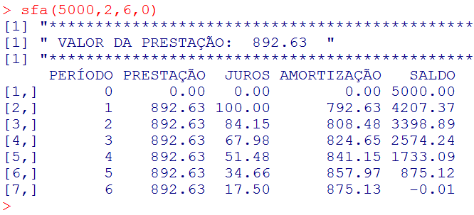
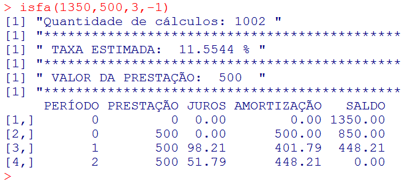
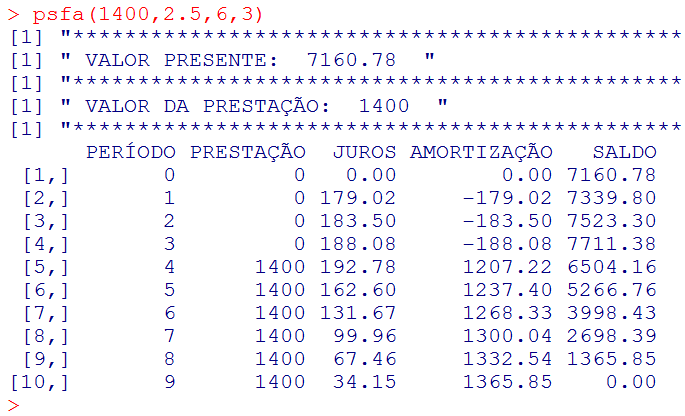
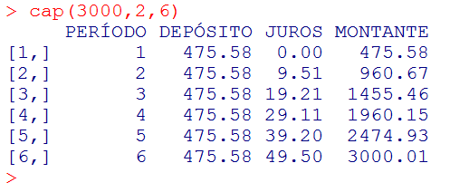
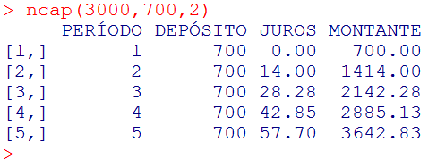
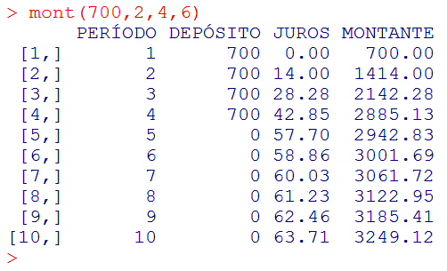
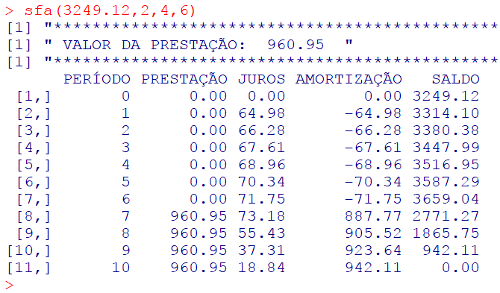

# Capítulo 7 

**Usando o R como Calculadora Financeira**

Jonas Liebl

## O que é o Software R

R é um software livre para computação estatística e gráficos. Além de ser amplamente utilizado para cálculos estatísticos no meio acadêmico, vem ganhando notoriedade em mineração de dados, tornando-se uma das ferramentas mais usadas por profissionais conhecidos como “cientistas de dados”. A principal página na Internet através da qual se pode baixar o software e iniciar o seu aprendizado é a https://www.r-project.org.

## Qual foi a proposta do minicurso ministrado no FTSL 2017

O software R se destaca como uma ferramenta estatística e esse estigma já é suficiente para desestimular o seu uso por profissionais de outras áreas. Ocorre que os seus comandos e a elevada capacidade de processamento podem facilitar a execução de atividades completamente distintas do segmento estatístico, sendo úteis inclusive para uso no ambiente doméstico de uma família. Uma das possibilidades que se mostraram excelentes é no campo da matemática financeira, em especial com sistemas de amortização e planos de capitalização. Além de realizar os cálculos, pode-se emitir planilhas de evolução, também conhecidas como “extratos”, e gravar arquivos muito úteis para inserção como anexos em contratos, por exemplo. Isso tudo é possível combinando-se funções e sintaxes de forma personalizada e gravando scripts para serem executados pelo R sempre que for necessário.

## O que é um sistema de amortização

Sistema de amortização é um método de cálculo que tem por objetivo pagar uma dívida ou financiamento no prazo contratado, remunerando-o à taxa pactuada. O mais conhecido é o “Sistema Francês de Amortização”, também chamado de “Tabela Price”. É esse sistema que se encontra residente na famosa calculadora financeira HP 12C. A sua principal característica é que apresenta prestações (ou parcelas) iguais. Alguns conceitos importantes:

**PV (present value)**: valor presente, que corresponde ao valor da dívida ou do financiamento que deverá ser quitado no prazo contratado.

**PMT (payment)**: pagamento, que é o valor da prestação a ser paga em cada período para amortizar a dívida ou financiamento e remunerá-lo pelos juros pactuados.

**i (interest)**: taxa percentual de juros destinada a remunerar a dívida ou financiamento. Deve ser expressa na mesma periodicidade das prestações, ou seja, se forem exigidas prestações mensais, a taxa percentual de juros também deverá ser equivalente a mês.

**n (número de períodos)**: quantidade de prestações para amortizar a dívida ou financiamento.

**modo antecipado**: ocorre quando a primeira prestação é paga no momento em que a dívida é contraída. É muito comum no comércio, quando se adquire determinado bem e a primeira prestação é dada como entrada no ato da compra.

**modo postecipado**: a prestação é paga no final do primeiro período, ou seja, se o prazo do financiamento for mensal, esse pagamento acontece um mês após a contratação e os demais, sequencialmente, a cada mês.

**modo diferido**: o início do pagamento das prestações ocorre após um período de carência. Por exemplo, uma compra no comércio realizada em novembro com primeira prestação a ser paga somente após o carnaval.

## Usando o R para cálculos relativos ao Sistema Francês de Amortização

Foram desenvolvidas algumas funcionalidades, consideradas as mais importantes, e gravadas num script denominado CALCULADORA FINANCEIRA.R. Sempre que precisar fazer algum cálculo desse tipo, basta abrir o R e executar Arquivo / Interpretar código fonte R, localizando o script já salvo no computador. O console do R apresentará as orientações básicas, as quais poderão ser recuperadas a qualquer momento através da função help(), ou, mais especificamente quanto ao “Sistema Francês de Amortização”, a help.sfa().

## Calculando uma prestação 

Determinada pessoa pretende obter um empréstimo de R$ 5.000,00 a ser quitado em 6 prestações mensais de igual valor, a primeira ocorrendo um mês após a contratação. Considerando que a taxa de juros é de 2% ao mês, vamos calcular o valor da prestação. Trata-se de um exemplo típico de cálculo pelo “Sistema Francês de Amortização” no modo postecipado. Conforme orientações fornecidas pelo script, deve-se comandar sfa() informando, entre os parênteses e entre vírgulas, o valor presente (valor do empréstimo), a taxa percentual mensal de juros, a quantidade de prestações mensais e o parâmetro de modo que, no caso do postecipado, é 0 (zero).

Note que o script do R não apenas calcula o valor da prestação, como também demonstra a evolução da dívida mês a mês. O saldo final negativo de R$ 0.01 ocorreu porque os cálculos foram arredondados para duas casas decimais. Sem esse arredondamento, o saldo seria zerado. Deve-se observar que o R adota o ponto como separador de decimais, que é a convenção utilizada em países de cultura inglesa. 

Outro benefício desse script é que o R gravou um arquivo denominado “EXTRATO.CSV” na mesma pasta que está definida para realizar os processamentos. Esse arquivo poderá ser aberto e formatado para inserção como anexo em contratos, para demonstrar a evolução da dívida.

## Calculando uma taxa de juros

Trata-se de um cálculo muito útil como subsídio para uma decisão. Por exemplo, uma pessoa pretende comprar uma geladeira de R$ 1.500,00 e a loja oferece duas opções de pagamento. A primeira é dividindo o valor em 3 parcelas mensais “sem juros”, com a primeira sendo paga no ato da compra. A segunda é o pagamento total à vista com um desconto de 10%. Como o comprador possui esse valor num investimento remunerado a 5% ao mês, deseja saber se vale a pena abrir mão do investimento para obter o desconto.

Intuitivamente, algumas pessoas dividem o 10% do desconto pelo número de parcelas e imaginam que a taxa mensal de juros embutida na operação é de 3,33%. Esse cálculo é equivocado porque não considera a antecipação do primeiro pagamento, nem a amortização mensal das parcelas subsequentes. No cálculo financeiro, devemos informar como valor presente aquele que seria pago na opção à vista: R$ 1.500,00 menos 10% de desconto, que é igual a R$ 1.350,00. As prestações são aquelas da opção a prazo, ou seja, R$ 1.500,00 dividido por 3, que corresponde a R$ 500,00. Finalmente, como o modo é antecipado, o parâmetro a ser utilizado é de -1 (menos um). Essas informações serão comandadas em **isfa()**.

No presente caso, perder o desconto que seria obtido na compra à vista para pagar a geladeira em 3 vezes “sem juros” representa uma taxa interna de juros na ordem de 11,5544% ao mês. Como a remuneração mensal do investimento é de 5%, ou seja, inferior a essa taxa interna de juros, a melhor opção é a de resgatar os R$ 1.350,00 do investimento e adquirir a geladeira à vista.

Não existe uma fórmula para calcular a taxa de juros de maneira direta. O seu cálculo é obtido por um processo iterativo. Note que o R informou que realizou 1002 cálculos para chegar ao resultado com quatro casas decimais, mas nós nem notamos isso porque ocorreu em fração de segundo. Se necessitarmos de mais casas decimais, precisaremos editar o script para aumentar o processo iterativo, mas isso só vale a pena quando os valores envolvidos são muito grandes. 

## Calculando o valor presente

É usual os bancos estipularem um limite de crédito pela capacidade de pagamento em função da renda mensal do tomador. Supondo que essa capacidade está delimitada a 30% da renda de R$ 5.000,00 de uma pessoa, a prestação total mensal não pode passar de R$ 1.500,00. Considerando ainda a existência de encargos acessórios no valor de R$ 100,00 a título de seguro e taxa de administração, a prestação mensal, destinada a amortização e juros, fica limitada a R$ 1.400,00. Vamos calcular qual seria o valor do empréstimo nessas condições, a ser resgatado em 6 prestações mensais iguais com 3 meses de carência, sendo a taxa de juros de 2,5% ao mês. As informações serão comandadas em **psfa()**.

O valor do empréstimo possível considerando a capacidade de pagamento e as regras do negócio é de R$ 7.160,78. Como se trata de um empréstimo com carência, durante os três primeiros meses só há incorporação de juros. O pagamento das prestações começa no quarto mês e a sua quitação ocorre no nono.

 
## O que é um plano de capitalização

Plano de capitalização é um método de cálculo que tem por objetivo formar um capital ou obter um montante, a partir de depósitos periódicos consecutivos remunerados a uma determinada taxa. O melhor exemplo de capitalização é um plano de previdência em que, durante muitos anos, é feito um depósito mensal de determinado valor com o objetivo de, a partir de determinada data, receber um benefício mensal a título de aposentadoria.

## Usando o R para cálculos relativos a planos de capitalização

Também foram desenvolvidas algumas funcionalidades, tidas como as mais importantes, e gravadas nesse script denominado CALCULADORA FINANCEIRA.R. O console do R apresentará as orientações básicas, as quais poderão ser recuperadas a qualquer momento através da função **help()**, ou, mais especificamente quanto a capitalizações e montantes, a **help.cap()**.

## Calculando o valor do depósito mensal

Vamos supor que uma pessoa deseja comprar um notebook de R$ 3.000,00 daqui a 6 meses e que, para isso, pretende economizar uma parcela fixa do seu salário depositando-a mensalmente numa aplicação que rende 2% ao mês. Faremos uso do comando cap(), informando, entre os parênteses e entre vírgulas, o valor do montante desejado, a taxa percentual mensal de juros e a quantidade de depósitos mensais.

O valor a ser economizado e depositado mensalmente é de R$ 475,58. Ao realizar o sexto depósito e computando os juros calculados sobre as parcelas precedentes, o valor de R$ 3.000,00 estará disponível para adquirir o pretendido notebook. 

## Calculando a quantidade de depósitos mensais

Imaginando que essa mesma pessoa tenha condições de economizar um pouco mais, elevando o depósito mensal para R$ 700,00, vamos calcular em quantos meses terá o montante disponível para a compra desejada. O comando a ser utilizado é o **ncap()**.

Cabe esclarecer que o desenvolvimento do script não prevê períodos fracionários. No exemplo em pauta, são depósitos mensais de igual valor efetuados sempre a cada mês. Percebemos que, no quarto mês, o valor está bem próximo do montante desejado. Com o quinto depósito, o montante já é mais do que suficiente para adquirir o notebook. Se o comprador deseja juntar exatamente os R$ 3.000,00, poderá ampliar o quarto depósito para o valor de R$ 814,87 (3.000,00 – 2.885,13 + 700,00) ou reduzir o quinto para R$ 57,17 (700,00 – 642,83). Assim, o montante exato será atingido com a parcela 4 ou 5, respectivamente.

## Calculando o montante

Essa funcionalidade tem o objetivo de calcular o montante obtido com os depósitos periódicos de igual valor e inclui a possibilidade de interromper a fase de depósitos, continuando apenas com a remuneração de juros sobre os saldos precedentes. 

Aproveitando o exemplo anterior de depósitos de R$ 700,00, vamos interromper a sequência após a quarta parcela e deixar o saldo sendo remunerado por mais 6 meses. O comando é o **mont()**, cujas orientações constam no **help.cap()**.

O montante parcial obtido no momento do quarto depósito continuou sendo remunerado a 2% ao mês por mais 6 meses, elevando o valor de R$ 2.885,13 para R$ 3.249,12. Percebe-se também que o valor necessário para a compra do notebook seria atingido dois meses após a interrupção dos depósitos.

## Considerações finais

O script **CALCULADORA FINANCEIRA.R** poderá ser baixado e usado tanto para os cálculos a que se propõe, quanto para conhecimento das sintaxes utilizadas para produzir esses resultados. Evidentemente, trata-se apenas de uma pequena incursão no mundo da matemática financeira para demonstrar que o R não está restrito à Estatística. As potencialidades do software podem nos ajudar em outras atividades profissionais ou acadêmicas. Como diria Goethe:

**Imagem: Goethe em 1828, óleo sobre tela de Stieler.**

## script CALCULADORA FINANCEIRA.R

O script para efetuar os cálculos mencionados neste capítulo pode ser obtido através do link:

http://www.angelfire.com/un/cde/CALCULADORA_FINANCEIRA.R

A inserção no R se dá através do comando **Arquivo / Novo script**, o qual abre uma janela de edição possibilitando colar o conteúdo previamente copiado da página do link. Na sequência, comanda-se **Arquivo / Salvar como**, selecionando-se a pasta onde se deseja salvá-lo e atribuindo-se o nome de CALCULADORA FINANCEIRA. A extensão R será assumida automaticamente. O comando **Arquivo / Fechar script** retorna ao console. 

A execução do script se dá através do comando **Arquivo / Interpretar código fonte R**, selecionando-se a CALCULADORA FINANCEIRA.R. O console mostrará as orientações contidas nas ajudas, as quais poderão ser resgatadas a qualquer tempo por help(), help.sfa() e help.cap().

Uma questão importante que merece a nossa atenção é a informação que aparece no console assim que ele é aberto: o “R é um software livre e vem sem GARANTIA ALGUMA”. Obviamente, essa garantia não existe porque o R é fruto de um ambiente colaborativo e é totalmente gratuito para o usuário. A hipótese de eventual bug não pode ser descartada, entretanto, dependendo do aplicativo que está sendo processado, é possível estabelecer um controle de qualidade que assegura total confiabilidade. É o caso dos sistemas de amortização. Ao visualizarmos uma planilha de evolução, o saldo ao final do prazo tende a zero. Eventual resíduo de pequena monta é decorrente do arredondamento do cálculo da prestação e dos juros. Já um saldo ao final do prazo incompatível com essa expectativa pode ser decorrente de erros no desenvolvimento do script ou, até mesmo, de um bug no software. 

Esse controle de qualidade também é possível em cálculos de capitalização. Se o cálculo tem o objetivo de obter o valor do depósito para compor determinado montante, o processamento estará correto se esse montante for atingido no prazo desejado. Outros tipos de cálculo de capitalização podem ter o controle de qualidade através de “engenharia reversa”.  Por exemplo, no exercício em que foram realizados 4 depósitos de R$ 700,00 e submetidos a mais 6 meses de rendimentos de juros à taxa percentual de 2% ao mês, chegou-se ao montante de R$ 3.249,12. A “engenharia reversa” desse cálculo é tomar o valor de R$ 3.249,12 como valor presente e submetê-lo ao Sistema Francês de Amortização com 4 prestações e 6 meses de carência, à taxa percentual de juros de 2% ao mês. O saldo final no décimo mês deve tender a zero. Isso confirma que a rotina para cálculo desse montante está correta.

**Devemos ter sempre em mente que nenhum software elimina o conhecimento humano. Aquilo que a tecnologia automatiza facilitando o nosso trabalho precisa de validação. Esse processo depende do conhecimento acadêmico e profissional na área de conhecimento que ensejou a demanda pelo desenvolvimento do aplicativo**.
