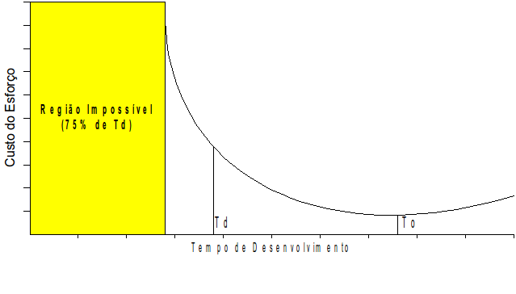
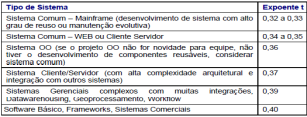

# Capítulo 9 

**Gerenciamento de Projetos apoiado por métricas de Software**

_Luciano Basso Buzzacaro_

Uma das formas eficientes de realizar o gerenciamento de projetos de software é fazer o uso de métricas para quantificar o desenvolvimento realizado. É muito complicado controlar ou monitorar o que são se pode medir. Sem monitorar o projeto, há poucas chances de saber se foi um sucesso ou fracasso ou se o andamento está indo na direção certa. A disciplina de gerenciamento de projetos conta com uma série de dados e métricas, que dão suporte à tomada de decisão e que ajudam a minimizar riscos e aumentar as certezas de sucesso quanto ao escopo, prazos e custos do projeto.

## O que é Pontos de Função (PF)?

	A métrica Análise de Pontos de Função - APF - é uma medida de dimensionamento de software através das funcionalidades implementadas em um sistema, sob o ponto de vista do usuário. É publicado como Padrão Internacional - norma ISO/IEC 14.143:2007. Foi criada em 1979 por Allan Albrecht. É gerida por um Grupo de Usuários Internacional através do IFPUG - International Function Point Users Group - www.ifpug.org. A métrica é regida por regras de contagem descritas no manual CPM - Counting Practices Manual  - Versão 4.3. São disponibilizadas as certificações CFPS - Certified Function Point Specialist e CFPP - Certified Function Point Practitioner.

## Por que medir?

* Para averiguar a qualidade do Produto;
* Avaliar a produtividade do processo;
* Formar uma Baseline para estimativas;
* Melhorar a gerência de projetos e relacionamento com clientes;
* Gerenciar contratos de software; 
* Entender e aperfeiçoar o Processo de desenvolvimento e manutenção de sistemas.

	Dentre as principais características podemos destacar:
* APF quantifica as funções contidas dentro de um software  em termos entendidos pelo usuário.
* APF relata diretamente os requisitos do negócio.
* APF é independente da tecnologia utilizada.
* APF torna possível as estimativas nas fases iniciais do processo de desenvolvimento de software.
* APF fornece facilidade para uma reestimativa
* APF fornece suporte à: orçamento do software, tempo de duração do projeto e gerência 
* APF apoia a análise de produtividade e qualidade

## Principais objetivos da métrica

* Medir a funcionalidade requisitada e recebida pelo usuário;
* Medir Projetos de Desenvolvimento e de Manutenção Evolutiva independentemente da tecnologia utilizada
* Simplicidade: ser simples o suficiente para minimizar o trabalho adicional envolvido no processo de medição.
* Consistência: Prover uma medida consistente entre vários projetos e organizações.

## Tipos Funcionais – Funções de Dados

**Arquivo Lógico Interno (ALI)**: é um grupo de dados, logicamente relacionados, reconhecido pelo usuário, mantido por meio de um processo elementar da aplicação que está sendo contada.

**Arquivo de Interface Externa (AIE)**: é um grupo de dados, logicamente relacionados, reconhecido pelo usuário, mantido por meio de um processo elementar de uma outra aplicação e referenciado pela aplicação que está sendo contada. O AIE é obrigatoriamente um ALI de outra aplicação.

## Tipos Funcionais – Funções Transacionais

**Entrada Externa (EE)**: é um processo elementar que processa dados ou informação de controle que entram pela fronteira da aplicação. Seu objetivo principal é manter um ou mais ALI ou alterar o comportamento do sistema.

**Consulta Externa (CE)**: é um processo elementar que envia dados ou informação de controle para fora da fronteira da aplicação. Seu objetivo principal é apresentar informação para o usuário através da recuperação de dados ou informação de controle de ALI ou AIE.

**Saída Externa (SE)**: é um processo elementar que envia dados ou informação de controle para fora da fronteira da aplicação. Seu objetivo principal é apresentar informação para um usuário ou outra aplicação através de um processamento lógico adicional à recuperação de dados ou informação de controle. O processamento lógico deve conter cálculo, ou criar dados derivados, ou manter ALI ou alterar o comportamento do sistema.

## Etapas de Contagem

**a) Determinar o propósito da contagem**

O propósito da contagem de Pontos de Função é o de fornecer uma resposta a um problema 
do negócio. Determina o tipo de contagem de Pontos de Função e o escopo da contagem requerido. Influencia o posicionamento da fronteira do software a ser medido.

**b) Determinar o Tipo de Contagem**

\- Contagem de PF de Projetos de Desenvolvimento refere-se aos PF associados com a instalação inicial de um software novo.

\- Contagem de PF de Projetos de Melhoria refere-se aos PF associados com a melhoria (manutenção evolutiva) de um software existente (inclui funcionalidade que é adicionada, modificada ou excluída).

\- Contagem de PF de Aplicações refere-se aos PF associados com uma aplicação instalada. Funcionalidade da aplicação considerada do ponto de vista do usuário.

**c) Determinar o escopo da contagem**

O escopo da contagem de Pontos de Função define as funcionalidades que devem ser incluídas em uma contagem de Ponto de Função específica. É determinado pelo propósito da contagem de PF. Pode incluir mais que uma aplicação.

**d) Determinar a Fronteira da Aplicação**

A determinação da fronteira da aplicação é baseada no ponto de vista do usuário e na funcionalidade do negócio e não na implementação tecnológica.

**e) Contar as funções de Dados**

Identificar os Arquivos Lógicos Internos (ALI) e os Arquivos de Interface Externa (AIE).

**f) Contar as funções transacionais**

Identificar as Entradas Externas (EE), as Saídas Externas (SE) e as Consultas Externas (CE).

**g) Calcular os pontos de função não ajustados da contagem**

Calcular a contribuição funcional de cada função a partir da tabela de complexidades do Manual de Contagem.

**h) Documentar e reportar a contagem de PF**

É importante documentar o propósito, tipo da contagem, escopo, fronteira, premissas contratuais, documentos utilizados, especialistas do negócio e outras pessoas entrevistadas e quaisquer outras informações que colaboraram para as tomadas de decisão durante a contagem. Registre todas as informações relevantes no parecer do estimador. Ainda, documente as funcionalidades com clareza, rastreie os requisitos de origem da funcionalidade. Porém, recomenda-se não exagerar com documentação excessiva que poderá sobrecarregar o esforço do processo de contagem.

## Evolução de Requisitos - Scope Creep

As contagens de PF realizadas durante as fases do processo de software (ex: requisitos, implementação, testes) são estimativas da funcionalidade que será entregue quando a aplicação for implantada. À medida que o escopo do projeto é definido e as funções são desenvolvidas, é comum identificar-se funcionalidades adicionais que não foram especificadas originalmente. Este fenômeno é chamado SCOPE CREEP (Mudança de Requisitos ou Evolução de Requisitos). É essencial realizar uma contagem final de PF após a conclusão do projeto. Em contratos de software baseados em PF, para efeitos de faturamento, deve-se considerar a contagem final de PF. Além disso, deve-se definir como tratar as mudanças de requisitos nas estimativas e no faturamento. 

## Estimar o esforço do projeto

Antes de mais nada, vale ressaltar que a métrica APF mede tamanho de software e não o esforço para construí-lo. Todavia, a partir do tamanho funcional podemos derivar o esforço baseado na Taxa Média de Produtividade da equipe, ou seja o esforço Homem-Hora (HH/PF) do tipo do projeto em questão. É fundamental a existência de uma Base Histórica de Projetos na organização. Deve-se buscar nos dados históricos a taxa média de produtividade (HH/PF) de projetos similares ao projeto em questão. 

O cálculo do esforço é realizado multiplicando-se a quantidade de PF pela taxa média de produtividade (HH/PF), esta definida normalmente pelo gestor do projeto, através da fórmula:

Esforço = PF x HH/PF

## Estimativas de Prazo 

A estimativa de prazo baseada na Fórmula de Capers Jones.

Sendo:

* Td é o tempo ótimo de desenvolvimento.
* To é o tempo que acarreta o menor custo.
* To = 2 Td.

Vale observar pelo gráfico que é impossível terminar em menos que 0,75 * Td, considerando-se mantidas as premissas de qualidade e escopo. 

_Fórmula de Capers Jones: Td (meses) = V^t_

Onde:

1) Td é o tempo ótimo de desenvolvimento, em meses.

2) V é o volume em Pontos de Função.

3) t é um expoente que depende do ambiente computacional considerado

O expoente t é escolhido a partir das características do tipo de sistema em desenvolvimento, baseado na seguinte tabela:

## Quantas pessoas você alocaria para desenvolver o seu projeto? 

Considerando uma produtividade de 7 horas em uma jornada de trabalho de 8h/dia o prazo em dias pode ser determinado pela fórmula:

_Prazo (em dias) = Esforço (horas) / (Tamanho da equipe * 7)_

Podemos determinar o tamanho da equipe dividindo o esforço em horas pelo prazo em dias multiplicado pela produtividade, através da fórmula:

_Tamanho da equipe = Esforço (horas) / Prazo (dias) x 7_

## Roteiros de Métricas

As organizações podem criar seus próprios Roteiros de Métricas de Contagem baseados nos princípios da métrica APF e aplicar deflatores ou fatores de ajuste sobre os processos elementares identificados de acordo com cada tipo de projeto. É uma forma eficiente de dimensionar de forma mais adequada os pontos de função ajustados com a finalidade de remuneração de fábrica de software contratada e realizar o faturamento de contratos baseados em pontos de função. Como exemplo podemos citar o Roteiro de Métricas SISP, bastante conhecido em licitações e contratos de software realizados por órgãos de governo junto a prestadores de serviço de desenvolvimento e manutenção de sistemas.

Após a definição de um roteiro de métricas para a organização é importante observar boas práticas para mantê-lo atualizado:
\- Revisar o Roteiro sempre que tiver mudança de versão do Manual CPM, ou publicação de White Paper pelo IFPUG.

\- Revisar o Roteiro sempre que surgir uma situação não prevista no mesmo.

\- Analisar o Roteiro periodicamente, avaliando a simplicidade, consistência e adequação das fórmulas às demandas com base no feedback das equipes de desenvolvimento.

\- Incluir no Roteiro modelos para a Documentação de Requisitos de Projeto de Desenvolvimento e de Manutenção.

\- Incluir modelos para a Documentação da Contagem de Pontos de Função.

Para que o processo de contagem atinja os objetivos de quantificar de forma eficiente as funcionalidades desenvolvidas e entregues para o usuário e para que haja eficácia na realização da contagem é relevante observar boas práticas na documentação de requisitos. Dentre as principais vale ressaltar a importância:

* Obter um Documento de Requisitos com Qualidade;
* Manter a documentação de Requisitos atualizada evitando problemas como: requisitos omissos; requisitos inconsistentes; requisitos incompletos; e requisitos ambíguos.

Para a estimativa inicial de um novo sistema elaborar um Documento de Visão (DV) que contenha minimamente: descrição das necessidades e funcionalidades (Incluir, Alterar, Excluir, Consultar).

## Referências

[Jones, 2007]	JONES,C. **Estimating Software Costs** – Bringing Realism to Estimating. 2nd Edition, Mc Graw Hill, New York, 2007. New York.

[McConnell , 2006] Mc CONNELL, S . **Software Estimation**: Demystifying the Black Art - Microsoft Press 2006.

[Parthasarathy, 2007]  PARTHASARATHY, M. A. **“Practical Software Estimation**: function point methods for insourced and outsourced projects”. Addison Wesley, 2007

[HAZAN, 2008] Hazan, Claudia. **ES Magazine**, Maio 2008.

[IFPUG, 2010] IFPUG, International Function Point Users Group. **Manual de Práticas de Contagem de Pontos de Função**, Versão 4.3.1.

[ROTEIRO SISP, 2016] Secretaria de Tecnologia da Informação. **Roteiro de Métricas de Software do SISP**: versão 2.2 / Ministério do. Planejamento, Desenvolvimento e Gestão. Secretaria de Logística e Tecnologia da Informação. – Brasília : MP, 2016. Acesso 09-02-2018.
Disponível em https://www.governoeletronico.gov.br/documentos-e-arquivos/Roteiro%20de%20Metricas%20de%20Software%20do%20SISP%20-%20v2.0.pdf

